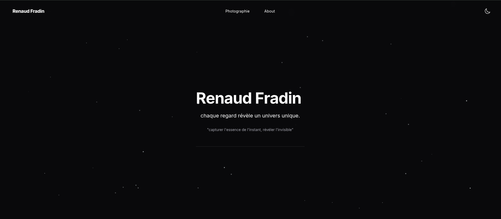

<h1 align="center">
  Renaud Fradin Photography
</h1>



## 🛠 Installation & Set Up

1. Install dependencies

```sh
yarn install
```

2. Start the development server

```sh
yarn dev
```

3. Format code

```sh
yarn run format
```
